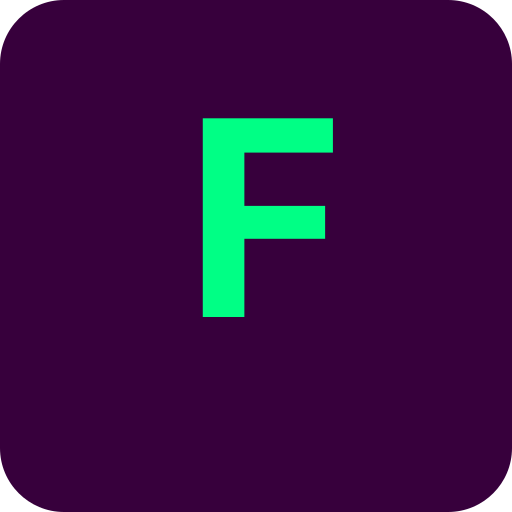

# FPL Insights

**The AI-powered Fantasy Premier League companion that helps you make smarter decisions.**


<p align="center">
  
</p>

---

## What is FPL Insights?

FPL Insights combines real-time FPL data with Claude AI to give you an edge in Fantasy Premier League. Whether you're chasing a mini-league title or climbing the overall ranks, our tools help you make data-driven decisions.

**Key differentiators:**

- **Claude AI Integration** - The only FPL tool with extended thinking AI for complex transfer analysis
- **Mini-League Intelligence** - Deep rival analysis with effective ownership and chip tracking
- **Predictive Models** - Captain scores, price predictions, and fixture difficulty analysis
- **PWA Support** - Works offline, installable on any device, push notifications

---

## Features

### Live Gameweek Tracking

Track your team during matches with real-time scores, bonus point predictions, and live rank updates.

### AI Transfer Optimizer

Ask Claude anything about your team. Get personalized transfer recommendations that consider your budget, fixtures, mini-league position, and risk tolerance.

> _"Should I take a -4 to get Salah for the double gameweek?"_

### Captain Selector

Multi-factor captain rankings considering form, fixtures, expected goals, set pieces, and ownership. Never second-guess your armband again.

### Fixture Difficulty Planner

Visual FDR grid with automatic double/blank gameweek detection. Identify fixture swings to time your transfers perfectly.

### Mini-League Analyzer

Know exactly where you stand against rivals:

- Effective ownership comparison
- Your differentials vs their differentials
- Swing scenario analysis
- Rival chip tracking

### Chip Strategy Advisor

Optimal chip timing recommendations based on fixtures, your squad, and remaining gameweeks. Includes chip performance history with verdicts.

### Draft Mode

Full draft support with:

- Snake draft simulator with pick suggestions
- Auction budget planner
- ADP-based player rankings
- Keeper league analysis

### Smart Notifications

- Deadline reminders (push & email)
- Price change alerts
- Injury updates for your players
- Weekly transfer recommendation emails

---

## How It Works

```
┌─────────────────────────────────────────────────────────────┐
│                     Your Browser (PWA)                       │
├─────────────────────────────────────────────────────────────┤
│                                                             │
│  ┌─────────────┐  ┌─────────────┐  ┌─────────────────────┐  │
│  │  Dashboard  │  │    Live     │  │   AI Optimizer      │  │
│  │             │  │  Gameweek   │  │                     │  │
│  └──────┬──────┘  └──────┬──────┘  └──────────┬──────────┘  │
│         │                │                    │             │
└─────────┼────────────────┼────────────────────┼─────────────┘
          │                │                    │
          ▼                ▼                    ▼
┌─────────────────────────────────────────────────────────────┐
│                    Next.js API Routes                        │
│                                                             │
│  • FPL Data Proxy (cached)     • Claude AI Integration      │
│  • Rate Limiting               • Push Notifications         │
└─────────────────────────────────────────────────────────────┘
          │                                     │
          ▼                                     ▼
┌─────────────────────┐             ┌─────────────────────────┐
│   FPL Official API   │             │      Claude API         │
│                      │             │   (Extended Thinking)   │
│  • Bootstrap data    │             │                         │
│  • Live scores       │             │  • Transfer analysis    │
│  • Manager picks     │             │  • Squad optimization   │
│  • League standings  │             │  • Natural language     │
└─────────────────────┘             └─────────────────────────┘
```

### Data Flow

1. **FPL Data** - We proxy the official FPL API with server-side caching to reduce load and improve performance
2. **AI Analysis** - Claude processes your team data with extended thinking for nuanced recommendations
3. **Real-time Updates** - Live gameweek data refreshes automatically during matches
4. **Offline Support** - Service worker caches essential data for offline access

### Privacy

- **No FPL credentials needed** - We only use your public Manager ID
- **Optional sign-in** - Google auth is only for cross-device sync
- **Your data stays yours** - We don't store your team data server-side

---

## Quick Start

```bash
# Clone the repository
git clone https://github.com/yourusername/fpl.git
cd fpl

# Install dependencies
npm install

# Copy environment template
cp .env.example .env.local

# Start development server
npm run dev
```

Open [http://localhost:3000](http://localhost:3000)

**For production deployment, see the [Deployment Guide](./docs/DEPLOYMENT.md).**

---

## Documentation

| Document                                     | Description                                     |
| -------------------------------------------- | ----------------------------------------------- |
| **[Deployment Guide](./docs/DEPLOYMENT.md)** | Step-by-step production deployment instructions |
| **[User Guide](./docs/USER_GUIDE.md)**       | Complete guide to using all features            |
| **[API Reference](./docs/API.md)**           | API endpoint documentation                      |
| **[Contributing](./CONTRIBUTING.md)**        | How to contribute to the project                |
| **[Changelog](./CHANGELOG.md)**              | Version history and changes                     |

### For Developers

| Document                                                            | Description                              |
| ------------------------------------------------------------------- | ---------------------------------------- |
| **[CLAUDE.md](./CLAUDE.md)**                                        | Project structure and coding conventions |
| **[Architecture](./docs/archive/FPL_APPLICATION_SPECIFICATION.md)** | Original application specification       |
| **[Roadmap](./docs/archive/FUTURE.md)**                             | Future features and improvements         |

---

## Tech Stack

| Category      | Technology                              |
| ------------- | --------------------------------------- |
| **Framework** | Next.js 16 (App Router)                 |
| **Language**  | TypeScript 5 (strict mode)              |
| **Styling**   | Tailwind CSS v4                         |
| **UI**        | React 19, custom components             |
| **Auth**      | Supabase (Google OAuth)                 |
| **Database**  | Supabase PostgreSQL                     |
| **AI**        | Claude API (Sonnet + Extended Thinking) |
| **Hosting**   | Netlify                                 |
| **Testing**   | Vitest (676+ tests)                     |

---

## Commands

| Command                 | Description              |
| ----------------------- | ------------------------ |
| `npm run dev`           | Start development server |
| `npm run build`         | Production build         |
| `npm run lint`          | Run ESLint               |
| `npm test`              | Run unit tests           |
| `npm run test:watch`    | Run tests in watch mode  |
| `npm run test:coverage` | Run tests with coverage  |
| `npm run test:e2e`      | Run Playwright E2E tests |

---

## API Rate Limits

| Endpoint               | Limit   |
| ---------------------- | ------- |
| FPL proxy routes       | 100/min |
| Claude AI endpoints    | 10/min  |
| Notification endpoints | 20/min  |

---

## Contributing

We welcome contributions! Please see [CONTRIBUTING.md](./CONTRIBUTING.md) for guidelines.

1. Fork the repository
2. Create a feature branch
3. Make your changes with tests
4. Submit a pull request

---

## License

Private - All rights reserved.

---

## Acknowledgments

- [Fantasy Premier League](https://fantasy.premierleague.com/) for the data API
- [Anthropic](https://anthropic.com/) for Claude AI
- The FPL community for inspiration and feedback
